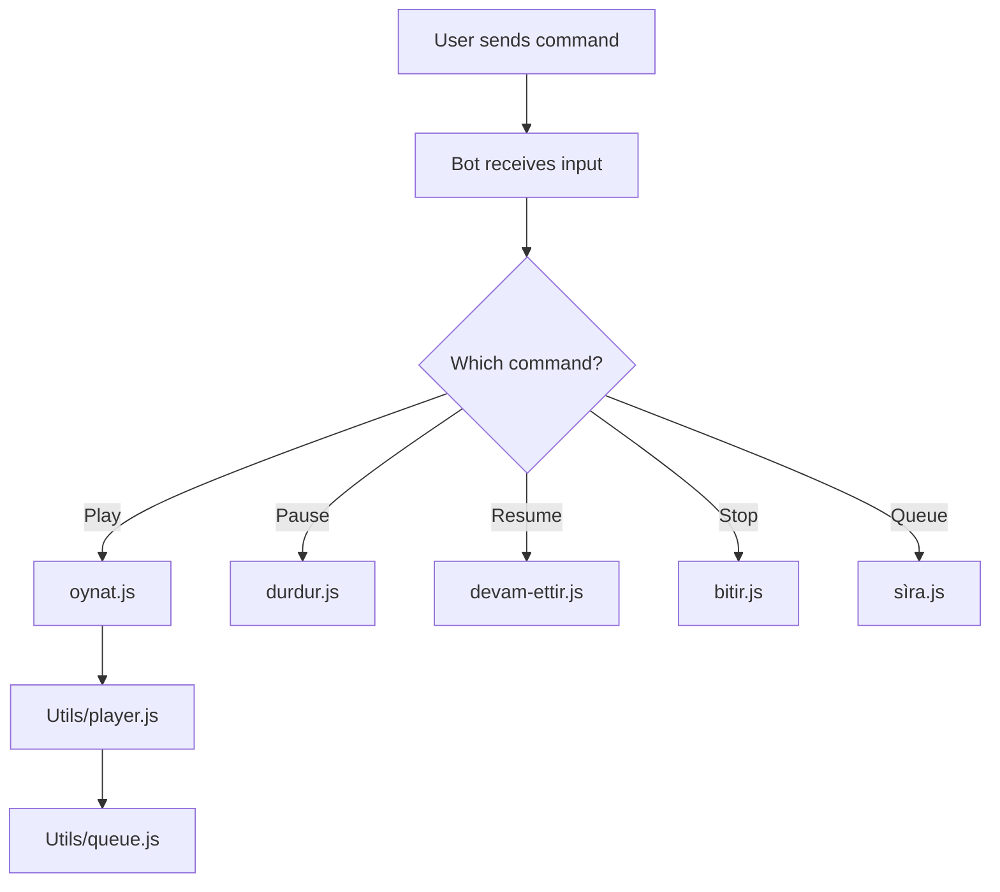

# 🎵 Basic Music System

A clean and powerful music system for your Discord bot! This system supports basic music playback commands, is user-friendly, and easy to customize.

## 📁 Project Structure

```
Music System/
├── arvis.js              # Main controller
├── bitir.js              # Stop command
├── devam-ettir.js        # Resume command
├── durdur.js             # Pause command
├── oynat.js              # Play command
├── sìra.js               # Queue display
├── Settings/
│   └── emojiler.json     # Emoji configuration
└── Utils/
    ├── player.js         # Music player logic
    └── queue.js          # Queue handling
```

## 🚀 Getting Started

### Prerequisites

- Node.js (v16 or higher)
- A Discord Bot Token
- FFmpeg installed and accessible in your PATH

### Installation

```bash
git clone https://github.com/ArviiSoft/basic-music-system.git
cd discord-music-system/Music\ System
npm install
```

### Running the Bot

```bash
node arvis.js
```

## 🎧 Available Commands

| Command File     | Description         |
|------------------|---------------------|
| `oynat.js`       | Plays a song        |
| `durdur.js`      | Pauses playback     |
| `devam-ettir.js` | Resumes playback    |
| `bitir.js`       | Stops playback      |
| `sìra.js`        | Shows the queue     |

## 🧠 Basic Flow Diagram



## 🤝 Contributing

Feel free to fork the project, submit issues, or send pull requests.

## 📄 License

This project is licensed under the MIT License.